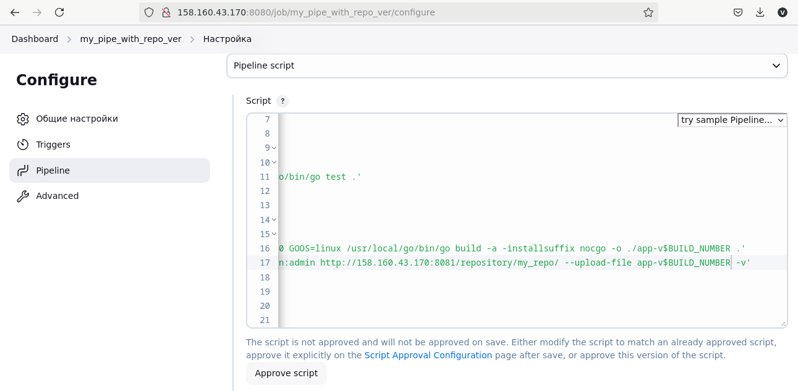

# Домашнее задание к занятию «Что такое DevOps. СI/СD». Потапчук Сергей.

### Инструкция по выполнению домашнего задания

   1. Сделайте `fork` [репозитория c шаблоном решения](https://github.com/netology-code/sys-pattern-homework) к себе в GitHub и переименуйте его по названию или номеру занятия, например, https://github.com/имя-вашего-репозитория/gitlab-hw или https://github.com/имя-вашего-репозитория/8-03-hw.
   2. Выполните клонирование этого репозитория к себе на ПК с помощью команды `git clone`.
   3. Выполните домашнее задание и заполните у себя локально этот файл README.md:
      - впишите сверху название занятия, ваши фамилию и имя;
      - в каждом задании добавьте решение в требуемом виде — текст, код, скриншоты, ссылка.
      - для корректного добавления скриншотов используйте [инструкцию «Как вставить скриншот в шаблон с решением»](https://github.com/netology-code/sys-pattern-homework/blob/main/screen-instruction.md);
      - при оформлении используйте возможности языка разметки md. Коротко об этом можно посмотреть в [инструкции  по MarkDown](https://github.com/netology-code/sys-pattern-homework/blob/main/md-instruction.md).
   4. После завершения работы над домашним заданием сделайте коммит `git commit -m "comment"` и отправьте его на GitHub `git push origin`.
   5. Для проверки домашнего задания в личном кабинете прикрепите и отправьте ссылку на решение в виде md-файла в вашем GitHub.
   6. Любые вопросы по выполнению заданий задавайте в чате учебной группы или в разделе «Вопросы по заданию» в личном кабинете.
   
Желаем успехов в выполнении домашнего задания!

---

### Задание 1

**Что нужно сделать:**

1. Установите себе jenkins по инструкции из лекции или любым другим способом из официальной документации. Использовать Docker в этом задании нежелательно.
2. Установите на машину с jenkins [golang](https://golang.org/doc/install).
3. Используя свой аккаунт на GitHub, сделайте себе форк [репозитория](https://github.com/netology-code/sdvps-materials.git). В этом же репозитории находится [дополнительный материал для выполнения ДЗ](https://github.com/netology-code/sdvps-materials/blob/main/CICD/8.2-hw.md).
3. Создайте в jenkins Freestyle Project, подключите получившийся репозиторий к нему и произведите запуск тестов и сборку проекта ```go test .``` и  ```docker build .```.

В качестве ответа пришлите скриншоты с настройками проекта и результатами выполнения сборки.

### Решение

1. Установил Jenkins по инструкции с [оффициального сайта](https://www.jenkins.io/doc/book/installing/linux/#debianubuntu)(главное на забыть про Java).

2. Установил Go по инструкции с [оффициального сайта](https://go.dev/doc/install)

3. Установил Docker по инструкции с [оффициального сайта](https://docs.docker.com/engine/install/ubuntu/)

4. Сделал [fork репозитория](https://github.com/potapchuksa/netology-homework-08-automation-ci-cd-8-02-what-is-devops-ci-cd-materials.git)

5. Создал в Jenkins Freestyle Project,


подключил к нему свой репозиторий,


в шаге сборки выбрал "Выполнить команду Shell" и добавил команды запуска теста и сборки Docker образа.


6. Вручную запустил проект на выполнение и получил результат.


---

### Задание 2

**Что нужно сделать:**

1. Создайте новый проект pipeline.
2. Перепишите сборку из задания 1 на declarative в виде кода.

В качестве ответа пришлите скриншоты с настройками проекта и результатами выполнения сборки.

### Решение

1. Создал в Jenkins Pipline,


2. Добавил в соответствующее поле [скрипт](pipeline-script-2.md).


3. Вручную запустил проект на выполнение и получил результат.


---

### Задание 3

**Что нужно сделать:**

1. Установите на машину Nexus.
1. Создайте raw-hosted репозиторий.
1. Измените pipeline так, чтобы вместо Docker-образа собирался бинарный go-файл. Команду можно скопировать из Dockerfile.
1. Загрузите файл в репозиторий с помощью jenkins.

В качестве ответа пришлите скриншоты с настройками проекта и результатами выполнения сборки.

### Решение

1. Развернул Docker контейнер Nexus,


проверил


2. Создал репозиторий.


3. Cоздал новый Pipeline


[текст скрипта](pipeline-script-3.md) на основе предыдущего


4. Вручную запустил проект на выполнение и получил результат.


5. Проверил результат в репозитории


---
## Дополнительные задания* (со звёздочкой)

Их выполнение необязательное и не влияет на получение зачёта по домашнему заданию. Можете их решить, если хотите лучше разобраться в материале.
---

### Задание 4*

Придумайте способ версионировать приложение, чтобы каждый следующий запуск сборки присваивал имени файла новую версию. Таким образом, в репозитории Nexus будет храниться история релизов.

Подсказка: используйте переменную BUILD_NUMBER.

В качестве ответа пришлите скриншоты с настройками проекта и результатами выполнения сборки.

### Решение

Добавил в предыдущее решение к имени переменную с номером текущей сборки. [Новый скрипт](pipeline-script-4.md)



Запускаю.


Проверяю.


